autoscale: true
slidenumbers: true
theme: Next, 9

# Tech Talk #14

# リモートワークのいままでと これからの話

@tatsuroro
2017.5.17

---

# tatsuroro

福岡からリモートワークしています

^ 最近東京オフィス来すぎてて、家族からお前はリモートワークとはと詰められています

---

## 本日お話するのは、リモートワークを Teck で Kaizen する Talk です

^ 覚えておいてほしいのでもう一度いいますね

---

# リモートワーク in Kaizen Platform,   これまでの振り返り

---

## 明快なガイドラインがある

- リモートワークについての考え方 (マネジメントの見解および採用について含む) / 2015年10月版
- リモートワークのガイドライン
- リモート会議のガイドライン
- 情報共有のガイドライン

---

## 自由な働き方

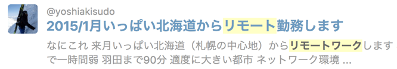

---

（この時は休暇でしたっけ、、、？）

---

## 最近は社会の追い風も

[クラフトボス『新しい風・誰もいない』篇](https://youtu.be/X8HbBaHeNR0)

---

## 皆で意識的に努力してきている

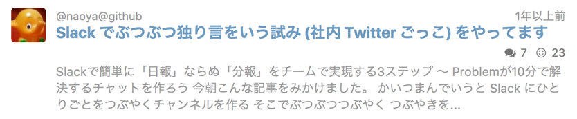

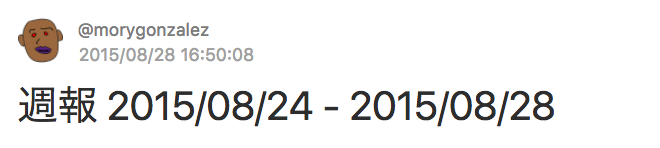
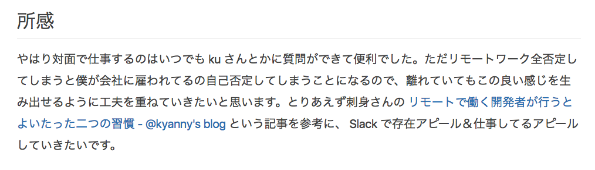

---

# リモートワークは 十分に機能しているだろうか？

みなさんどうですか？

^ Question to Audience

---

## フルリモートのメンバーで振り返りをやってみた

@jimbo @morygonzalez @tatsuroro

### 結果

- フルリモートは基本つらい、という話になった
  - リモートワークを掲げる会社だけど、東京近郊以外はマイノリティ
  - あえて自分から選択してるのだから、トレードオフは自分で解決に動く
    - **この talk はそのためのアクションでもあります**

---

# なぜつらいのか 改めて掘り下げてみた

^ リモートワークで足りないるものってなんだろう？

---

## ドキュメンテーションが足りない?

Qiitaなどで共有は十分になされている

  

- プロジェクトが佳境の時は、**キャッチアップできてるか不安** になる時も
  - 皆忙しいので丁寧な情報共有をしきれない時もある
  - 暗黙知をなくす意識は皆で持ち続けよう
  - 不安に思ったらすぐに「あれってどうなってます？」アクションを取るべし

---

## 心理的安全性に課題？

- メンバー、マネージャーの皆、HRT は意識していると思う
- なので、これが大きな課題というわけではなさそう
- ただ、チーム内で人柄の相互理解が進めば、仕事の質も良くなることはある
  - つきあい長いと、離れててもなんとなくお互いの考えを理解できたり

---

## ゆるいコミュニケーションの不足

- 雑談しづらい (Slack に　#times_hoge はあるけども)
- オフィスに居れば気軽に声をかけられる
- **キャッチアップのしづらさ**
  - わざわざビデオ会議 or Slack call するほどでも、、、

---

## よそのやり方も参考にしてみた

- オフショア開発の場合
- ソニックガーデンの場合

---

### オフショア開発はなぜうまく回るのか

- タスクの分担が明確
- 上意下達が前提にある (それぞれの方針が事前に明確になっている)
- チームはそれぞれの Shore に分かれている
  - チームの代表同士が会話してるので、実質 1on1

---

### ソニックガーデンのやりかた

- Remotty を活用 (Squiggle 的なはたらきをしている模様）
- 「メンター制」「毎週のふりかえり」等、こまめにコミュニケーションして課題感を棚卸ししている

---

### ソニックガーデンのやりかた

- **全員でPCとイヤホン** を使ってビデオ会議に参加
- プロジェクト会議の参加者は最大**3～4人**までと限定
  - 会議に直接出ない選択肢も
  - 録音しておいて、キャッチアップしたいメンバーは後から聞く

  
**↑　参考になりそう**

---

# "リモートワークを成功させようという、メンバー全員の合意があること"

    
[ソニックガーデンはなぜリモートワークを成功させたのか──離れても仕事がうまくいく4つの秘訣](https://codeiq.jp/magazine/2016/08/43882/)

---

## Kaizen Platform でも、 部分的にはうまくいってる

- Hangout, Zoom は日常的に活用しているし
- 開発のパフォーマンスに明らかな差があるわけではない

---

## 掘り下げてみて、わかってきたこと

- コミュニケーションにいつも課題がある
- キャッチアップが必要になる & やりづらさがある
- **少人数(2人〜5人)でプロジェクトを進めている時は、あまりつらくない**
  - こまめに Sync するコストが低いから？

### [全社合宿] ---------> [少人数プロジェクト開発]

この2つの間で課題を感じている

---

# うまくいく ミーティングと そうでない ミーティングがある

---

## 会議体の種類とリモートワークの関係性

リモートワークでつらさを感じるポイントと、 ミーティングのスタイルや内容に相関がありそう

### 着目点

- 人数
  - オフィスメンバー / リモートメンバーの比率も場合により考慮
- 議論の抽象度

---

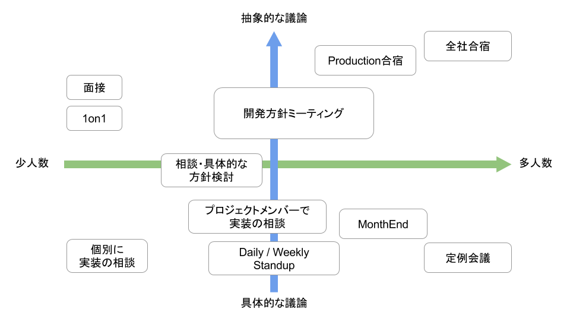

---

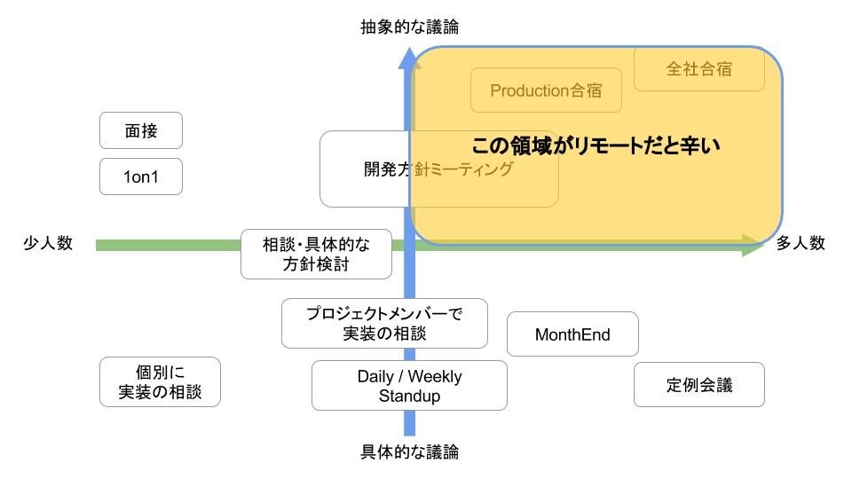

---

## 抽象度の高いミーティングや 議論のポイントが定まってない場合は なるべくオフラインに寄せた方がいい

---

## ミーティングのフォーマットによって、 スタンスを使い分けることを"全員が"意識する

*リモートメンバーを含むミーティングのスタイル*

| 人数 | 抽象度 | スタイル |
| --- | --- | --- |
| 1on1 | 低〜中 | 必然的にお互いリモートスタイルになる |
| 3-6人 | 低〜中 | できれば**全員**リモートスタイルで |
| 7-14人 | 中〜高 | リモートメンバーはオブザーブする(必要なら出社) |
| それ以上 | 高 | オフサイト合宿 |

※ これに時差が加わると、さらにスタイルへの配慮が必要

---

### プロジェクト会議の参加者は最大**3～4人**までと限定

なるべくこうした方がいい
- 早めに担当を分担、チームを小分けにして裁量を持つ

 

### JP × US × 抽象度高 × 大人数

無理ぽい

---

# ミーティングが オンラインになることで 失なわれるもの

---

## 熱意、場の空気、発言のニュアンスなど ノンバーバル・エモーショナルな要素

> "対面では簡単に伝わるのに画面越しでは伝わらない何か"

  

- 人間が普段無意識にやっている、コミュニケーションを補足しているもの
  - <--> 初音ミク、ペッパー

---

## F2F のようなミーティング感

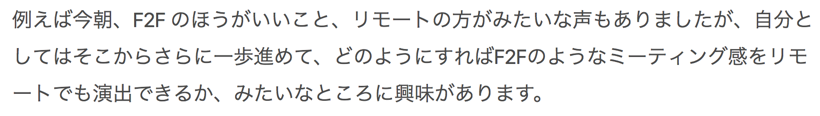
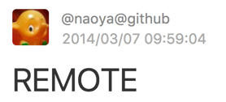

^ これはずっと言われ続けてる

---

> 去年くらいのRebuildでnaoyaさんが言ってたけど、雰囲気（感情）が伝わるツールが欲しいって言ってたけど、やっぱそうゆうのもっと必要だろうなと思った。

---

## コール & レスポンスによる共感・共鳴のコミュニケーション

> A「○○○○ っていう方針でいこうと思うんです」
B「つまり XXXX なサービスにするということ？」
A「そうそう」
B「なるほどね、いいんじゃない」
C「△△△△ っていうツールとか活用できますよ」
A 「いいっすね」

- 共感を伴う議論において **テンポの良さ** は重要な要素
- **「間」** は大事
- 会議室でテンポよく議論が進んでいると、リモートから会話に入りづらい
- **オンラインミーティングにつきもののレイテンシと、非常に相性が悪い**

---

## Google は「密集」する道を選んだ

> Googleの例では、社員同士が密集した空間でやり取りを行い、相互に刺激し合って新しいアイデア、イノベーティブな観点を発見することを重視しています。

 

> 「密集」をまず選択し、そこで問題となる部分の多くは、高収益体質がカバーするという構造

[.footer:「オフィス」VS「リモートワーク」世界の最先端企業に学ぶ未来の働き方8つの観点 (https://mirai.doda.jp/theme/remotework/office-vs-remotework/)]

---

## Google は「密集」する道を選んだ

> 「密集」の良さに関する今回の議論では、特に「前例のない新しいプロジェクトに取り組む」「役割が定まらない新しいメンバー同士で仕事をする」といった場面に適している

 

> 「密集」してプロジェクトを進めることで「熱気」が共有され、チームの営みがさらに加速する

[.footer:「オフィス」VS「リモートワーク」世界の最先端企業に学ぶ未来の働き方8つの観点 (https://mirai.doda.jp/theme/remotework/office-vs-remotework/)]

---

## リモートで「雰囲気」「熱気」を共有するのは 無理なのか？

   

naoya といえば、、、

---

# Rebuild

**機材や録音・編集処理を年々改善していて、とても聴きやすいことで定評がある**

[Podcasting Guide 2017](https://weblog.bulknews.net/podcasting-guide-2017-2e88531a367d)

---

## 他の Podcast と比べた時の、 伝わってくるニュアンスの量

[Rebuild](http://rebuild.fm/176a/) と、 [genba.fm](https://genba.fm/) との比較

   

- 機材、環境が違うと明らかに差がある

※ genba.fm もこれから改善するとのことですが

---

## 音質、レイテンシが問題なら 技術で雰囲気問題を解決できるのでは

- 高品質な機材を用いて
- 高品質なボイスチャットができれば、多人数のオンラインミーティングで臨場感を得られるかも

---

# コミュニケーションツールを試す

---

## 全員リモートの Discord 環境を作った

- 雑談タイムを設けて、皆でDiscordの音声チャンネルを開いて仕事
- オフィスメンバーも皆高性能マイク & イヤフォンを使用

---

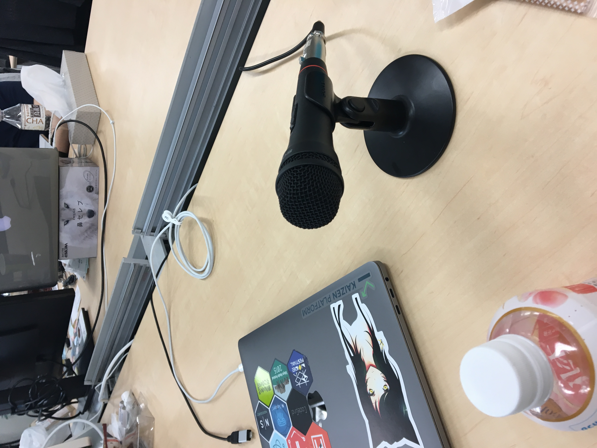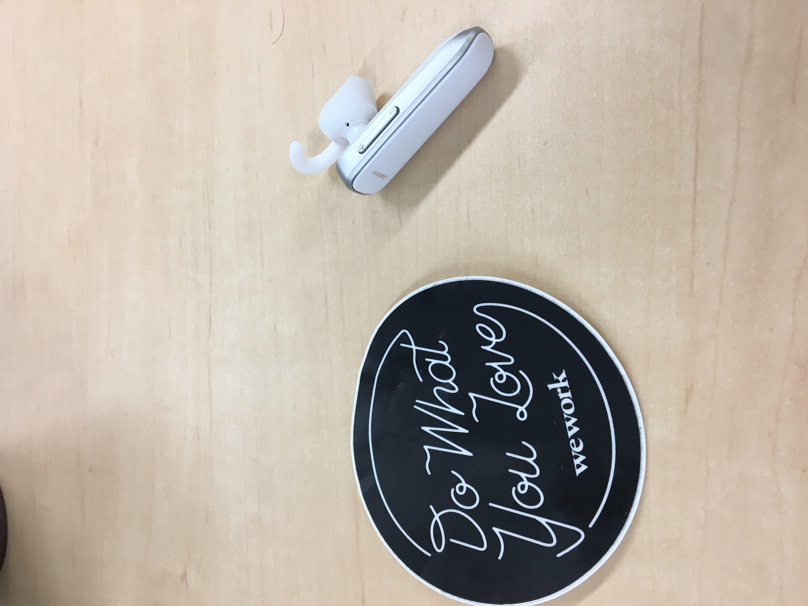

---

### 結果

- 低レイテンシ
- 高音質（ニュアンスまで拾える）

   
非常に臨場感高く、**F2F感のあるトーク** ができるようになった

---

### 雑談にも、開発中のコミュニケーションにも有意義

- Discord、とても臨場感あって良いです
  - あとは必要に応じてお互いの顔が見えるようにできて
  - スクリーンシェアがあれば完璧

- Hangout or Zoom ですべて解決できればベストだけれども
- Amazon Chime結構良さげ（検証中）
- **Slack Call に Voice, Video, スクリーンシェアが揃った**

---

## よくあるシチュエーション

### 会議室に Yeti Mic ひとつ、5〜6人で議論(1〜2人リモート)

- マイクから遠いと声が聞こえづらい
- 話しかけるタイミングを取りづらい
- **スピーカーからの自分の声のボリュームが気になる**
  (「うるさっ」とか、「声ちっさ」っていう不具合)
- 環境セットアップまでのタイムロス

---

### 具体実装の議論なら

- リモートメンバーはオブザーブに近いスタンスを意識して、タイミングを見て質問して理解を同じくする、でも大丈夫

### 抽象度が高くなりそうな議論の時は

  - みんなイヤフォンしませんか？
  - でも、ずっとコードぶら下げてるのは面倒ですよね
  - AirPods or others, アリなのでは？ （検証したい）

---

## 「全員リモート」の話は ガイドラインに書いてあったりする

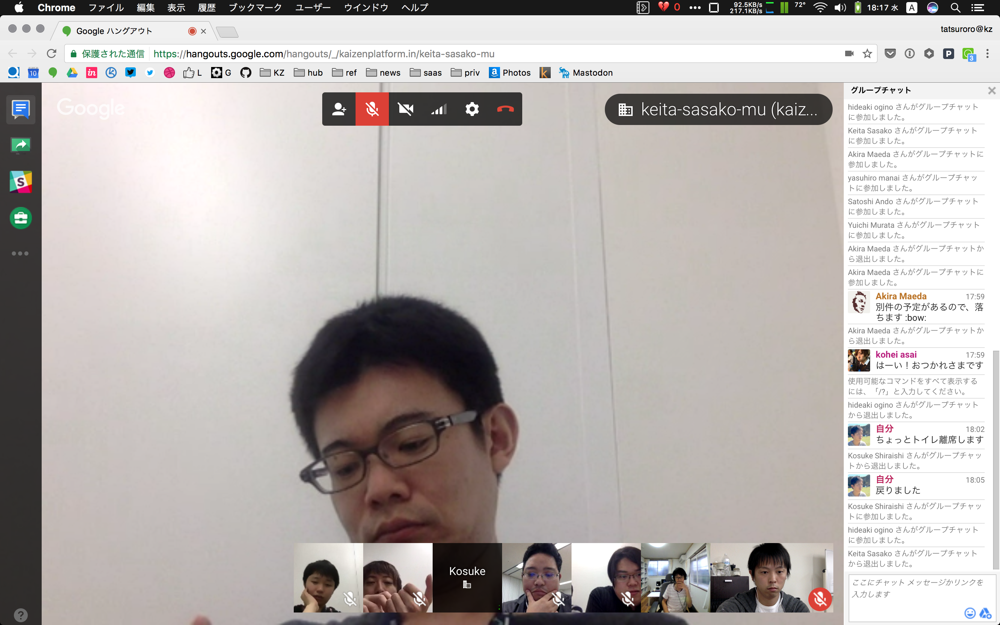
全員 Hangout で顔を出すようにしています

---

**「抽象度の高いミーティングはオフラインに寄せる」**

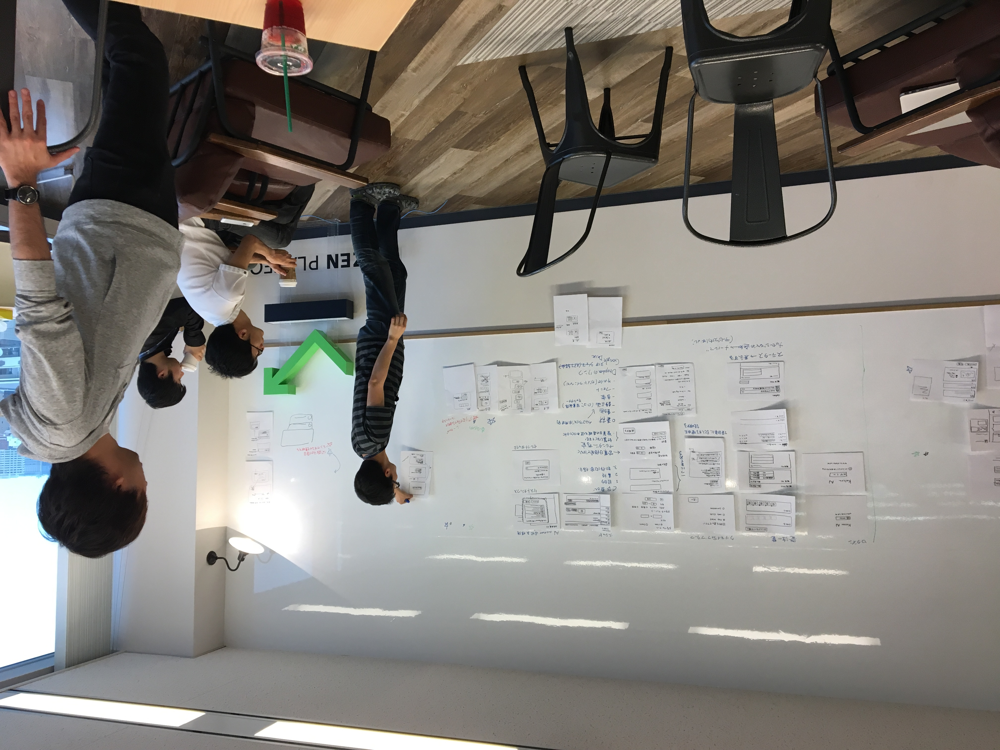

---

# まとめ

---

## リモートワークは一日にして成らず

- まずは課題をみんなで共有しよう
  - ミーティングのフォーマットを意識する
  - 「皆がリモートワーカーである」という意識

---

## Kaizen を続けよう

- オンラインミーティングで雰囲気を伝える努力
  - 会議体に適したツールを試しつづける
  - 良い機材を使おう
- リモートでも雑談しよう
- もちろん定期的に顔合わせるのは大事
  - プロジェクトの状況に応じて、責任持って柔軟に動く

---

## 雑談大事。

- 1on1 でも、XonX でも
- **”人間は感情の生き物です"**
- 情報のキャッチアップもしやすくなる
- 誰かが声かけてもいいし、雑談を促す BOT がいてもいい

---

## 「皆がリモートワーカーである」という意識

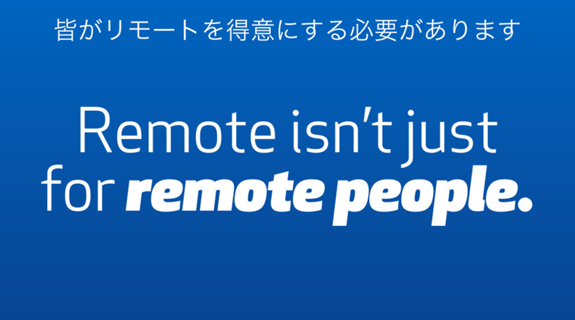

---

## 働き方の自由は幸せにつながる

^ みんなそこは同意でしょ？

---

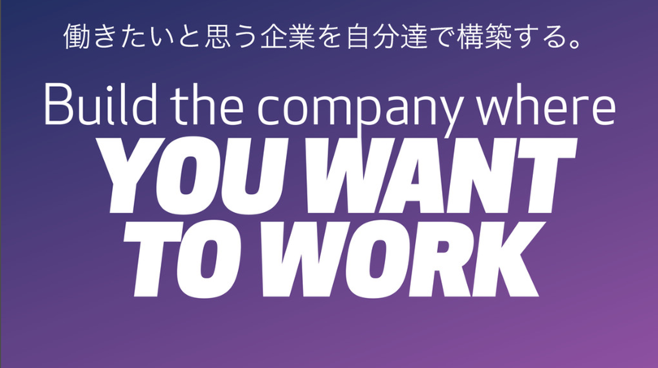

---

